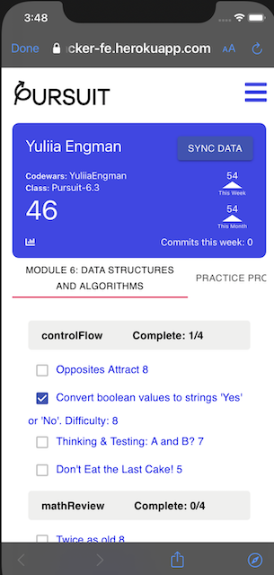
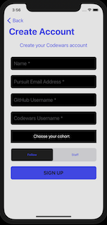
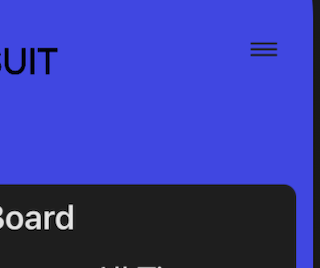
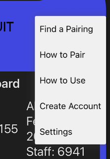
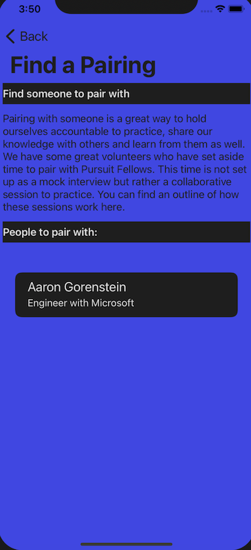
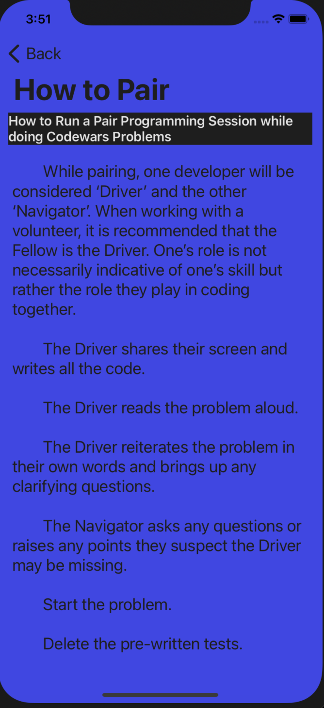
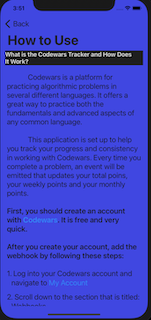

# CodeWarsTracker-iOS

## Overview

codewars

       

## Features

### Browsing 

Scroll Users           | Search User             | Change Color Theme
---------------------- | ----------------------- | -----------------------
 |  | 

### User Details 
 
### Create Account  
      

### Menu for Further App Assistance
 




## Code Block

### Block

```swift

```

### Block 2

```Swift

```

## Installation

### Prerequisites

* steps

### Clone

* Clone this repo to your local machine using

### Setup

* Add a Swift file named Config to project directory.


## Built With

* XCode

* Swift

* SnapKit

## Collaborators

[Juan Ceballos](https://github.com/Juan-Ceballos)

[](https://github.com/Juan-Ceballos)

